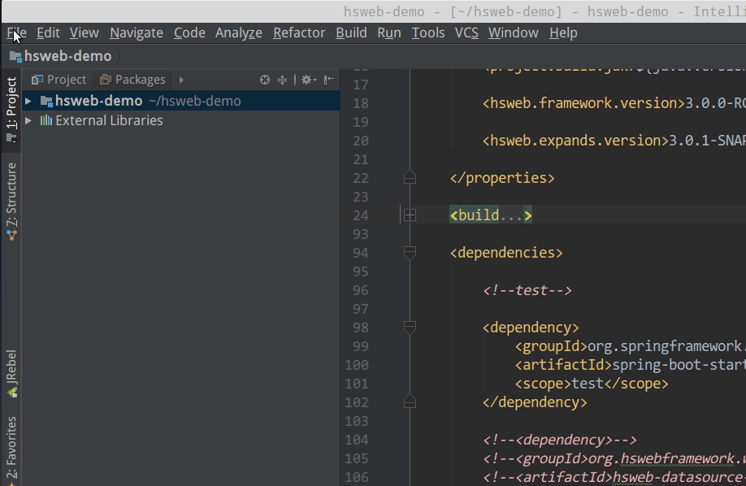
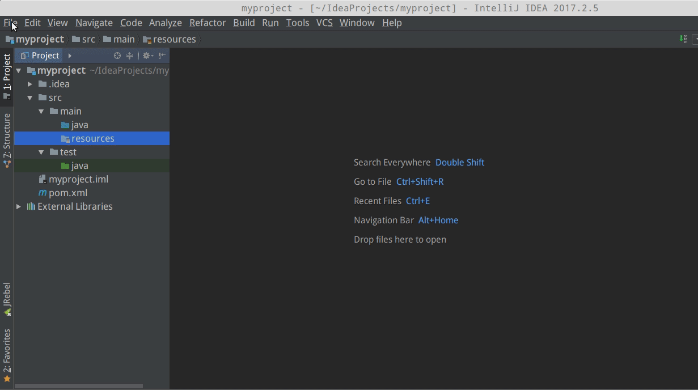
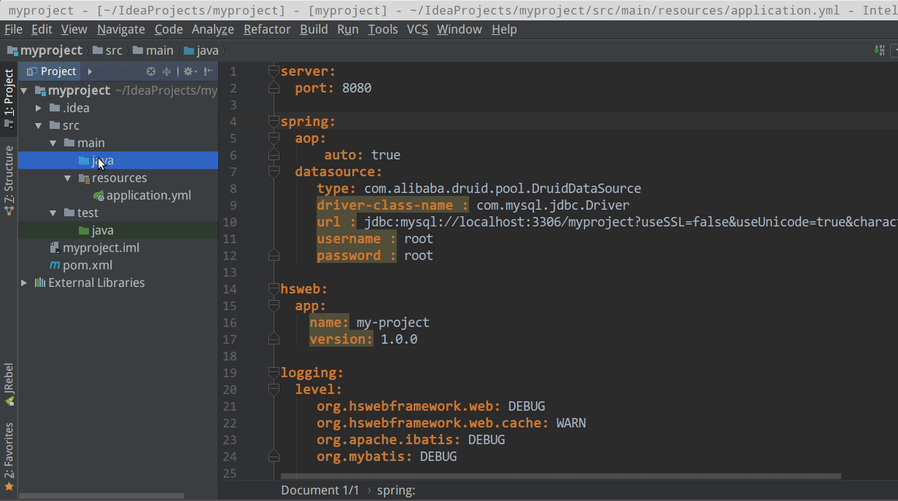
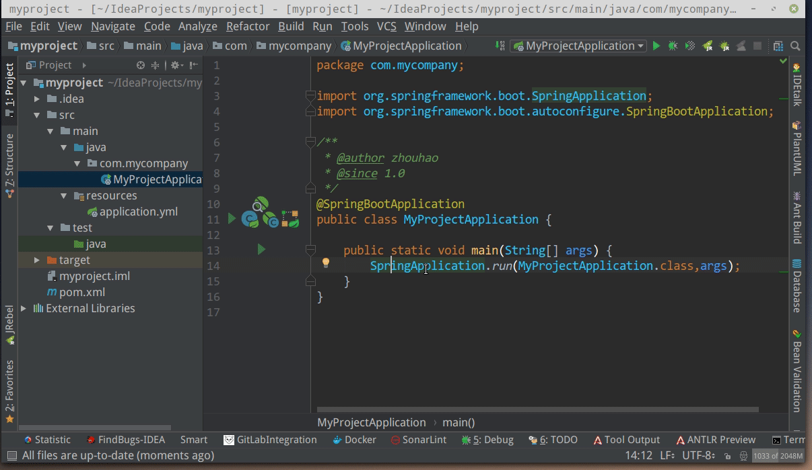

# 快速开始

从0开始创建一个基于hsweb的项目。在本文档中，使用的开发环境为`IntelliJ IDEA`

## 创建项目



## 编辑`pom.xml`


如果对maven不够熟悉,maven的设置请使用默认设置,不要在settings.xml里自己添加私服. 否则可能出现依赖无法下载的问题。 编辑后请reimport maven。




```markup
<?xml version="1.0" encoding="UTF-8"?>

<project xmlns="http://maven.apache.org/POM/4.0.0"
         xmlns:xsi="http://www.w3.org/2001/XMLSchema-instance"
         xsi:schemaLocation="http://maven.apache.org/POM/4.0.0 http://maven.apache.org/xsd/maven-4.0.0.xsd">
    <modelVersion>4.0.0</modelVersion>

    <groupId>com.mycompany</groupId>
    <artifactId>myproject</artifactId>
    <version>1.0-SNAPSHOT</version>
    <properties>
        <project.build.sourceEncoding>UTF-8</project.build.sourceEncoding>
        <project.build.locales>zh_CN</project.build.locales>
        <spring.boot.version>1.5.13.RELEASE</spring.boot.version>

        <java.version>1.8</java.version>
        <project.build.jdk>${java.version}</project.build.jdk>
        <!--hsweb版本-->
        <hsweb.framework.version>3.0.6</hsweb.framework.version>
    </properties>

    <build>
        <finalName>${project.artifactId}</finalName>
        <resources>
            <resource>
                <directory>src/main/resources</directory>
                <filtering>true</filtering>
            </resource>
        </resources>
        <plugins>
            <!--编译插件-->
            <plugin>
                <groupId>org.apache.maven.plugins</groupId>
                <artifactId>maven-compiler-plugin</artifactId>
                <version>3.1</version>
                <!--指定编译器版本和字符集-->
                <configuration>
                    <source>${project.build.jdk}</source>
                    <target>${project.build.jdk}</target>
                    <encoding>${project.build.sourceEncoding}</encoding>
                </configuration>
            </plugin>

            <!--
            spring-boot插件
            1. 可以使用命令 mvn spring-boot:run 直接运行项目
            2. 使用mvn package命令打包为可执行jar,通过jar -jar 运行项目
            -->
            <plugin>
                <groupId>org.springframework.boot</groupId>
                <artifactId>spring-boot-maven-plugin</artifactId>
                <version>${spring.boot.version}</version>
                <configuration>
                    <!--启动类-->
                    <mainClass>com.mycompany.MyProjectApplication</mainClass>
                    <layout>ZIP</layout>
                </configuration>
                <executions>
                    <execution>
                        <goals>
                            <goal>repackage</goal>
                        </goals>
                    </execution>
                </executions>
            </plugin>

        </plugins>
    </build>

    <dependencies>

        <!--test-->
        <dependency>
            <groupId>org.springframework.boot</groupId>
            <artifactId>spring-boot-starter-test</artifactId>
            <scope>test</scope>
        </dependency>
        <dependency>
            <groupId>org.hswebframework.web</groupId>
            <artifactId>hsweb-tests</artifactId>
            <version>${hsweb.framework.version}</version>
            <scope>test</scope>
        </dependency>
        
        <!--必须要引入的依赖-->        
        <!--对spring-cache一些问题的修复-->
        <dependency>
            <groupId>org.hswebframework.web</groupId>
            <artifactId>hsweb-concurrent-cache</artifactId>
            <version>${hsweb.framework.version}</version>
        </dependency>
        
        <!--spring-boot-starter-->
        <dependency>
            <groupId>org.hswebframework.web</groupId>
            <artifactId>hsweb-spring-boot-starter</artifactId>
        </dependency>

        <dependency>
            <groupId>org.springframework.boot</groupId>
            <artifactId>spring-boot-starter-logging</artifactId>
        </dependency>
        
        <dependency>
            <groupId>org.codehaus.groovy</groupId>
            <artifactId>groovy-all</artifactId>
        </dependency>

        <dependency>
            <groupId>mysql</groupId>
            <artifactId>mysql-connector-java</artifactId>
            <version>5.1.40</version>
        </dependency>

        <dependency>
            <groupId>com.alibaba</groupId>
            <artifactId>druid</artifactId>
        </dependency>

        <dependency>
            <groupId>ch.qos.logback</groupId>
            <artifactId>logback-classic</artifactId>
        </dependency>

        <dependency>
            <groupId>org.slf4j</groupId>
            <artifactId>slf4j-api</artifactId>
        </dependency>
        
        <dependency>
            <groupId>org.springframework.boot</groupId>
            <artifactId>spring-boot-configuration-processor</artifactId>
            <optional>true</optional>
        </dependency>
        
        <dependency>
            <groupId>org.projectlombok</groupId>
            <artifactId>lombok</artifactId>
        </dependency>

        <!--以下为可选依赖,新增模块时,往这添加-->
        
        
    </dependencies>

    <!--统一依赖管理-->
    <dependencyManagement>
        <dependencies>
            <dependency>
                <groupId>org.hswebframework.web</groupId>
                <artifactId>hsweb-framework</artifactId>
                <version>${hsweb.framework.version}</version>
                <type>pom</type>
                <scope>import</scope>
            </dependency>
            
            <dependency>
                <groupId>com.alibaba</groupId>
                <artifactId>druid</artifactId>
                <version>1.0.26</version>
            </dependency>

            <dependency>
                <groupId>org.hswebframework.web</groupId>
                <artifactId>hsweb-spring-boot-starter</artifactId>
                <version>${hsweb.framework.version}</version>
            </dependency>

        </dependencies>

    </dependencyManagement>
    <!--pom里引入私服,无需再到 settings.xml中配置-->
    <repositories>
        <repository>
            <id>hsweb-nexus</id>
            <name>Nexus Release Repository</name>
            <url>http://nexus.hsweb.me/content/groups/public/</url>
            <snapshots>
                <enabled>true</enabled>
                 <updatePolicy>always</updatePolicy>
            </snapshots>
        </repository>
        <repository>
            <id>aliyun-nexus</id>
            <name>aliyun</name>
            <url>http://maven.aliyun.com/nexus/content/groups/public/</url>
        </repository>
    </repositories>

    <pluginRepositories>
        <pluginRepository>
            <id>aliyun-nexus</id>
            <name>aliyun</name>
            <url>http://maven.aliyun.com/nexus/content/groups/public/</url>
        </pluginRepository>
    </pluginRepositories>
    
</project>
```



## 创建配置文件

 在`resources`目录中创建`application.yml`配置文件





```yaml
server:
  port: 8080
spring:
  aop:
      auto: true
  datasource:
     type: com.alibaba.druid.pool.DruidDataSource
     driver-class-name : com.mysql.jdbc.Driver
     url : jdbc:mysql://localhost:3306/myproject?useSSL=false&useUnicode=true&characterEncoding=utf8&autoReconnect=true&failOverReadOnly=false
     username : root
     password : root

hsweb:
  app:
    name: my-project
    version: 1.0.0

logging:
  level:
     org.hswebframework.web: DEBUG
     org.hswebframework.web.cache: WARN
     org.apache.ibatis: DEBUG
     org.mybatis: DEBUG
```



##  创建启动类





```java
package com.mycompany;

import org.springframework.boot.SpringApplication;
import org.springframework.boot.autoconfigure.SpringBootApplication;

/**
 * @author zhouhao
 * @since 1.0
 */
@SpringBootApplication
public class MyProjectApplication {

    public static void main(String[] args) {
        SpringApplication.run(MyProjectApplication.class,args);
    }
}
```




## 创建数据库

此处使用`mysql`数据库, 可根据需要选择合适的数据库. 支持 `H2` `Mysql` `Oracle` `PostgreSQL`

```sql
CREATE DATABASE IF NOT EXISTS myproject default charset utf8 COLLATE utf8_general_ci; 
```

##  启动服务



打开浏览器访问 [http://localhost:8080](http://localhost:8080). 提示`Whitelabel Error Page`则说明服务启动成功. 因为现在还没有任何功能,所有提示错误信息.到此,项目建立完成,和普通的spring-boot项目没有区别.



