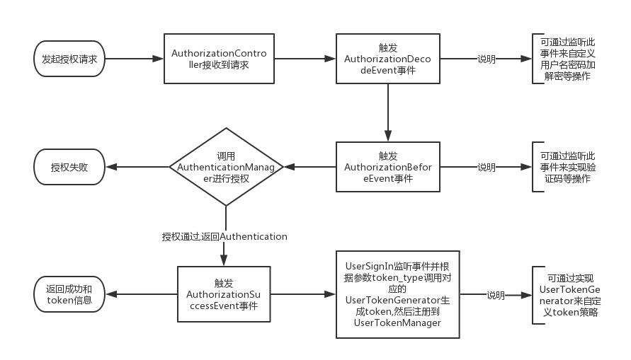

# 登录授权

## 授权

使用`hsweb-authorization-api`提供的监听器,类`UserOnSignIn`监听用户授权事件`AuthorizationSuccessEvent` 当用户完成授权\(授权方式可自行实现或者使用框架默认的授权方式,主要触发该事件即可\).授权通过后会触发该事件.流程如下



1. 完成授权,触发`AuthorizationSuccessEvent`
2. `UserOnSignIn` 收到`AuthorizationSuccessEvent`事件,获取参数`token_type`\(默认为`sessionId`\),以及授权信息
3. 根据`token_type` 调用对应的`UserTokenGenerator`生成token.
4. 将token和授权信息中的userId注册到`UserTokenManager`
5. 将token返回给授权接口


UserTokenGenerator 默认使用sessionId作为token,你可以实现UserTokenGenerator和UserTokenParser来进行自定义token实现 [前后分离](qian-hou-fen-li.md)


## 双因子验证

hsweb提供了双因子验证功能,默认提供了totp实现,可通过totp app\(比如:[Google Authenticator](https://github.com/google/google-authenticator)\)进行验证码获取.

### 开启双因子验证

配置 application.yml

```text
hsweb:
    authorize:
        two-factor:
            enable: true
        totp:
          enable: true # 开启totp支持
          domain: hsweb.me
```

在需要验证的接口上注解:

```java
@PostMapping
@TwoFactor("update-password") //调用此接口时,需要进行双因子验证
public ResponseMessage<Boolean> updatePassword(String password){
    //业务逻辑
}
```

### TOTP

如果开启了TOTP 双因子验证,在创建用户时会生成用户的totp验证密钥,并发出事件:`TotpTwoFactorCreatedEvent` ，通过监听此事件进行自定义处理：比如发送邮件通知等。

### 验证流程

1. 调用接口,判断当前是否已经验证通过
2. 如果没有验证通过,返回{"status":403,"code":"need\_tow\_factor","message":"需要进行双因子验证","provider":"totp"}
3. 客户端根据返回码,引导用户输入验证码
4. 将验证码添加到第一步的接口参数中,默认参数名为: `verifyCode`
5. 验证通过后,在`@TwoFactor(timeout=600000L)`毫秒内再次调用无需重复输入,默认为`10分钟`.

### 自定义验证策略

hsweb默认只提供了TOTP方式的验证实现,，但是提供了拓展方式可以自定义验证策略，比如：短信验证

1. 继承抽象类: `DefaultTwoFactorValidatorProvider`并重写对应方法
2. 修改配置: `hsweb.authorize.two-factor.default-provider=自定义的provider`，或者在注解中指定provider: `@TwoFactor(value="验证接口标识",provider="自定义的provider")`

## 授权登录接口

http接口: `POST /authorize/login`, 登录接口支持2种`content-type`,`application/json`\(Json RequestBody方式\)和`application/x-www-form-urlencoded`\(表单方式\), 请在调用等时候指定对应等`content-type`.必要参数: `username` 和 `password`.

⚠️注意: 此接口只实现了简单的登录逻辑,不过会通过发布各种事件来实现自定义的逻辑处理.

1. `AuthorizationDecodeEvent` 在接收到登录请求之后触发,如果在登录前对用户名密码进行里加密,可以通过监听此事件实现对用户名密码的解密操作
2. `AuthorizationBeforeEvent` 在`AuthorizationDecodeEvent`事件完成后触发,可通过监听此事件并获取请求参数,实现验证码功能
3. `AuthorizationSuccessEvent` 在授权成功后触发.注意: 权限控制模块也是通过监听此事件来完成授权
4. `AuthorizationFailedEvent` 授权失败时触发.当发生过程中异常时触发此事件

## 注销

与授权同理,类`UserOnSignOut`监听`AuthorizationExitEvent` ,当触发事件后,调用`UserTokenManager`移除当前登录的token信息

