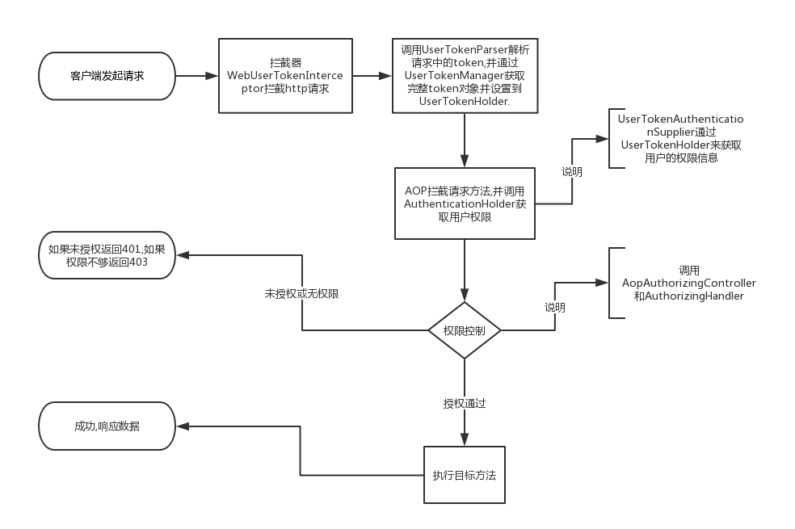

# RBAC权限控制

hsweb提供了常规的RBAC权限控制，默认基于AOP实现。`hsweb-authorization-api`  模块中定义了权限相关接口，核心类: 

`Authentication` : 用户的所有权限相关信息。

`AuthenticationManager`：用于管理用户的权限信息已经授权。

`AuthenticationSupplier`： 用于获取当前登录用户和指定用户的权限，可通过实现此接口来自定义权限获取方式。



## 注解权限控制声明

在需要进行权限控制的`Controller` 中注解`@Authorize` 以声明此接口需要控制权限。

属性列表:

<table>
  <thead>
    <tr>
      <th style="text-align:left">属性名</th>
      <th style="text-align:left">说明</th>
    </tr>
  </thead>
  <tbody>
    <tr>
      <td style="text-align:left">permission</td>
      <td style="text-align:left">权限标识,如: user-manager</td>
    </tr>
    <tr>
      <td style="text-align:left">action</td>
      <td style="text-align:left">操作,如: add</td>
    </tr>
    <tr>
      <td style="text-align:left">role</td>
      <td style="text-align:left">角色ID,如: admin</td>
    </tr>
    <tr>
      <td style="text-align:left">user</td>
      <td style="text-align:left">用户名,如: admin</td>
    </tr>
    <tr>
      <td style="text-align:left">logical</td>
      <td style="text-align:left">
        <p>存在多个声明时使用的策略:</p>
        <p>AND: 并且</p>
        <p>OR: 或者</p>
      </td>
    </tr>
    <tr>
      <td style="text-align:left">phased</td>
      <td style="text-align:left">
        <p>验证时机:</p>
        <p>before: 在请求之前</p>
        <p>after: 在请求之后</p>
      </td>
    </tr>
    <tr>
      <td style="text-align:left">ignore</td>
      <td style="text-align:left">忽略权限控制</td>
    </tr>
    <tr>
      <td style="text-align:left">description</td>
      <td style="text-align:left">权限说明</td>
    </tr>
    <tr>
      <td style="text-align:left">dataAccess</td>
      <td style="text-align:left">数据权限声明</td>
    </tr>
  </tbody>
</table>注意：

1. 在类上注解时,表示此类的所有接口都需要进行权限控制。
2. 方法和类上的注解默认将合并处理，如:类注解`@Authorize(permission="user-manager")`，方法注解 `@Authorize(action="add")`，在权限控制时会合并为`@Authorize(permission="user-manager",action="add")`

## 自定义权限控制声明

在注解方式进行声明时,可能不能完全满足需求，比如要修改已经打了包的模块的权限控制声明。

实现接口: `AopMethodAuthorizeDefinitionCustomizerParser`  ,实现`parse` 方法，返回 `AuthorizeDefinition` .即可。`AuthorizeDefinition` 的属性和`Authorize`注解基本一致，具体查看源代码即可。


如果返回`EmptyAuthorizeDefinition` 则表示不进行权限控制,如果返回`null` 则表示使用默认的权限定义。


## 事件

在进行权限控制时，会触发事件:`AuthorizingHandleBeforeEvent` ,可通过监听此事件,来实现自定义的权限控制。例如:

```text
@EventListener
public void handEvent(AuthorizingHandleBeforeEvent event) {
        if(event.getContext()
        .getAuthentication()
        .getUser()
        .getUsername()
        .equals("admin")){
         //admin用户拥有所有权限
           event.setAllow(true);
        }
}
```

通过配置文件设置不进行权限控制的接口



```yaml
hsweb:
    authorize:
        allows:
            users:
                admin: * # admin用户可以访问全部接口
                guest: **.query* # guest 可以返回query开头的方法
            roles:
                admin: *
```




