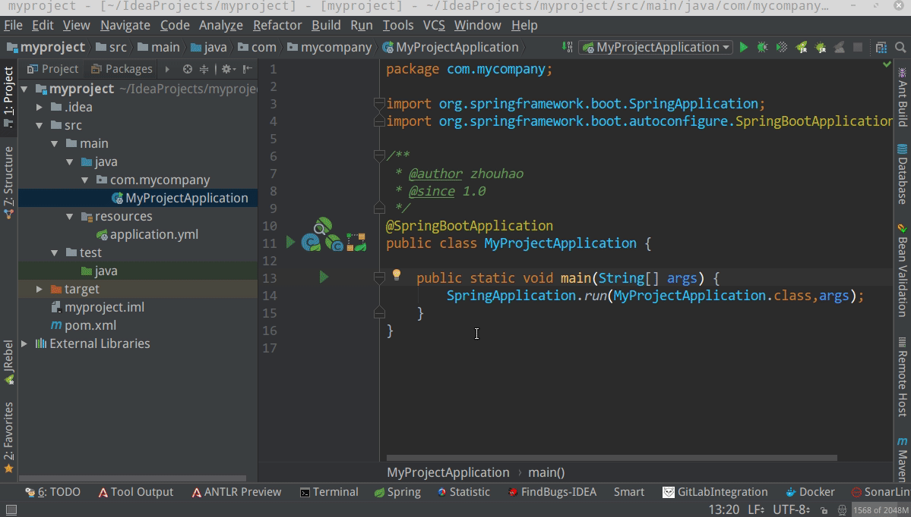
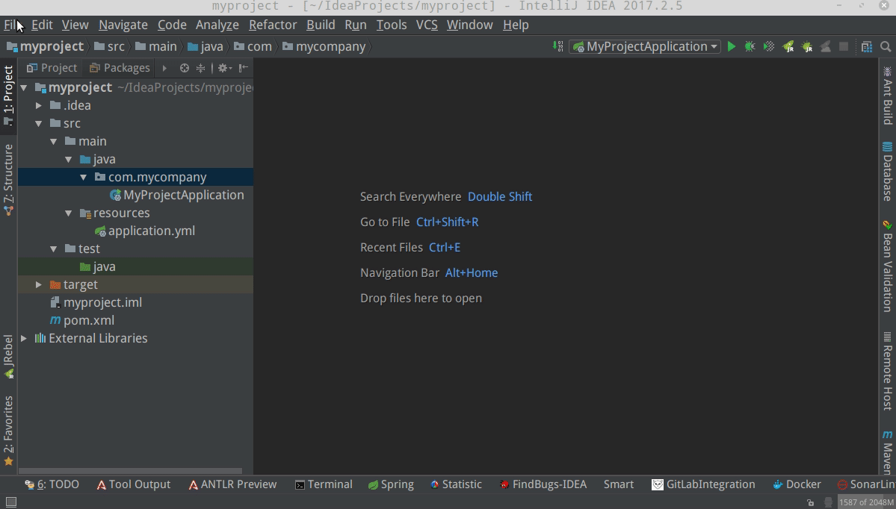
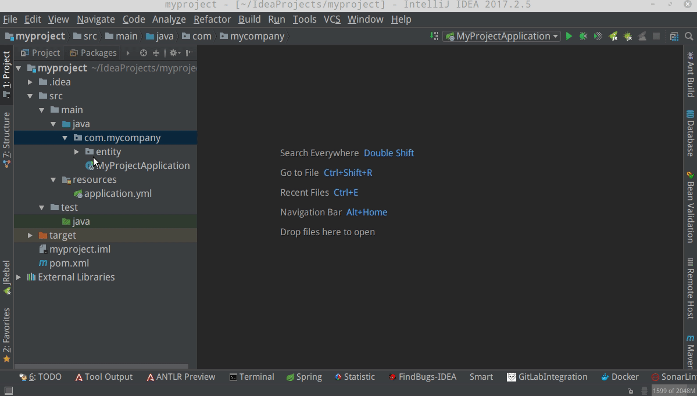
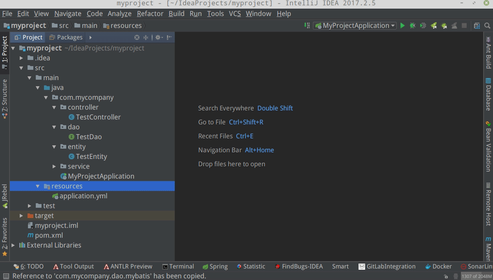
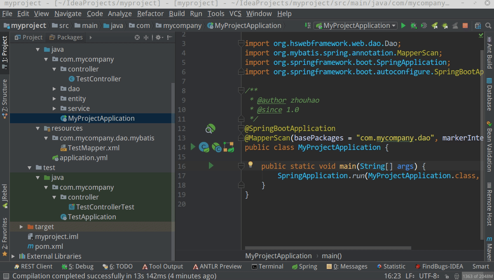

# 通用CRUD

## 说明

本文档基于在 [快速开始](../kuai-su-kai-shi.md) 中创建的项目。演示如何创建一个通用增删改查功能。

## 引入依赖

在 [pom.xml](../kuai-su-kai-shi.md#bian-ji-pomxml) 中添加依赖





```markup
<!--通用CRUD-->
<dependency>
    <groupId>org.hswebframework.web</groupId>
    <artifactId>hsweb-commons-dao-mybatis</artifactId>
    <version>${hsweb.framework.version}</version>
</dependency>
<dependency>
    <groupId>org.hswebframework.web</groupId>
    <artifactId>hsweb-commons-service-simple</artifactId>
    <version>${hsweb.framework.version}</version>
</dependency>
<dependency>
    <groupId>org.hswebframework.web</groupId>
    <artifactId>hsweb-commons-controller</artifactId>
    <version>${hsweb.framework.version}</version>
</dependency>

```



## 创建数据库表

```sql
create table tb_test(
        id varchar(32) primary key,
        name varchar(32) not null,
        status tinyint,
        comment text
    )
```

除了手动创建表,还可以使用 [数据库版本控制](shu-ju-ku-ban-ben-kong-zhi.md) 进行表结构维护。

## 创建实体类

创建实体类 com.mycompany.entity.TestEntity 

实体类可通过继承:`org.hswebframework.web.commons.entity.SimpleGenericEntity<主键类型>`.来使用通用的crud功能.





```java
@Getter //如果报错请安装lombok插件
@Setter
public class TestEntity extends SimpleGenericEntity<String> {
    private String name;

    private Byte status;

    private String comment;
}
```



## 创建Dao接口

dao接口可通过继承:`org.hswebframework.web.dao.CrudDao<实体类,主键类型>`.来使用通用的crud功能.





```java
public interface TestDao extends CrudDao<TestEntity,String> {

}
```



## Mybatis Mapper Xml

创建myabtis mapper,在`resources`目录上创建:`com/mycompany/dao/mybatis/TestMapper.xml`,


注意: 目录分割使用`/`而不是`.`






```markup
<?xml version="1.0" encoding="UTF-8" ?>
<!DOCTYPE mapper
        PUBLIC "-//mybatis.org//DTD Mapper 3.0//EN"
        "http://www.mybatis.org/dtd/mybatis-3-mapper.dtd">
<mapper namespace="com.mycompany.dao.TestDao">
    <resultMap id="TestEntityResultMap" type="com.mycompany.entity.TestEntity">
         <!--如果没有使用JPA注解,必须在此明确定义字段映射关系-->
        <id property="id" column="id" javaType="String" jdbcType="VARCHAR"/>
        <result property="name" column="name" javaType="String" jdbcType="VARCHAR"/>
        <result property="status" column="status" javaType="Byte" jdbcType="TINYINT"/>
        <result property="comment" column="comment" javaType="String" jdbcType="CLOB"/>
    </resultMap>

    <!--用于动态生成sql所需的配置-->
    <sql id="config">
        <bind name="resultMapId" value="'TestEntityResultMap'"/>
        <bind name="tableName" value="'tb_test'"/>
    </sql>

    <insert id="insert" parameterType="com.mycompany.entity.TestEntity" >
        <include refid="config"/>
        <include refid="BasicMapper.buildInsertSql"/>
    </insert>

    <delete id="deleteByPk" parameterType="String">
        delete from tb_test where id =#{id}
    </delete>

    <delete id="delete" parameterType="org.hswebframework.web.commons.entity.Entity">
        <include refid="config"/>
        <include refid="BasicMapper.buildDeleteSql"/>
    </delete>

    <update id="update" parameterType="org.hswebframework.web.commons.entity.Entity">
        <include refid="config"/>
        <include refid="BasicMapper.buildUpdateSql"/>
    </update>

    <select id="query" parameterType="org.hswebframework.web.commons.entity.Entity" resultMap="TestEntityResultMap">
        <include refid="config"/>
        <include refid="BasicMapper.buildSelectSql"/>
    </select>

    <select id="count" parameterType="org.hswebframework.web.commons.entity.Entity" resultType="int">
        <include refid="config"/>
        <include refid="BasicMapper.buildTotalSql"/>
    </select>
</mapper>
```



## 配置Application

一、编辑`application.yml`



```yaml
mybatis:
  mapper-locations: classpath:com/mycompany/dao/mybatis/**/*.xml
```



  二、 在`MyProjectApplication`上添加注解:`@MapperScan(basePackages = "com.mycompany.dao", markerInterface = org.hswebframework.web.dao.Dao.class)`

## 创建Service


### Service接口

service接口可通过继承:`org.hswebframework.web.service.CrudService<实体类,主键类型>`.来使用通用的crud功能. 



```java
public interface TestService extends CrudService<TestEntity,String> {
}
```



### 实现类

实现类可通过继承: `org.hswebframework.web.service.GenericEntityService<实体类,主键类型>`.来使用通用crud功能.



```java
@Service
public class TestServiceImpl extends GenericEntityService<TestEntity,String>
        implements TestService {

    @Autowired
    private TestDao testDao;

    @Override
    protected IDGenerator<String> getIDGenerator() {
        return IDGenerator.MD5;
    }

    @Override
    public TestDao getDao() {
        return testDao;
    }
}
```




并不是所有功能都是CRUD,也不是所有功能都需要接口+实现类的方式，请根据情况选择合适的方式。


## 创建Controller

controller 可通过实现接口: `org.hswebframework.web.controller.SimpleGenericEntityController<实体类,主键类型,org.hswebframework.web.commons.entity.param.QueryParamEntity>`



```java
@RestController
@RequestMapping("/test")
public class TestController implements SimpleGenericEntityController<TestEntity, String, QueryParamEntity> {

    @Autowired
    TestService testService;

    @Override
    public CrudService<TestEntity, String> getService() {
        return testService;
    }
}
```




并不是所有的controller都需要使用完整的CRUD功能, 请根据实际情况选择合适的方式.


## 启动服务

执行启动类 `TestApplication` ，服务启动完成后使用Idea自带的`Test Restful Web Servcice` 进行测试。



一个简单的增删改查功能就创建完成了。 

接下来你可以试试







